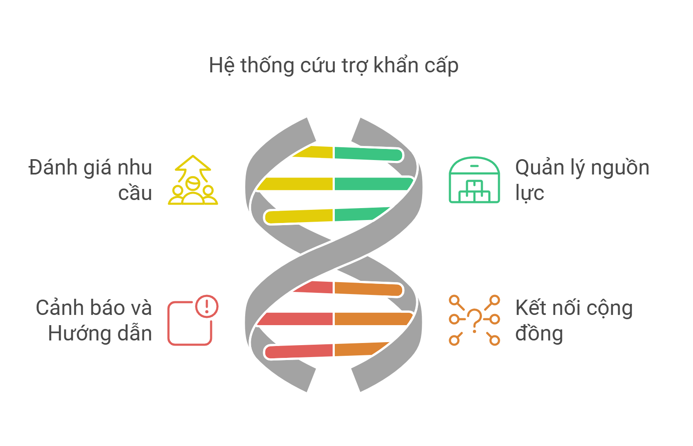
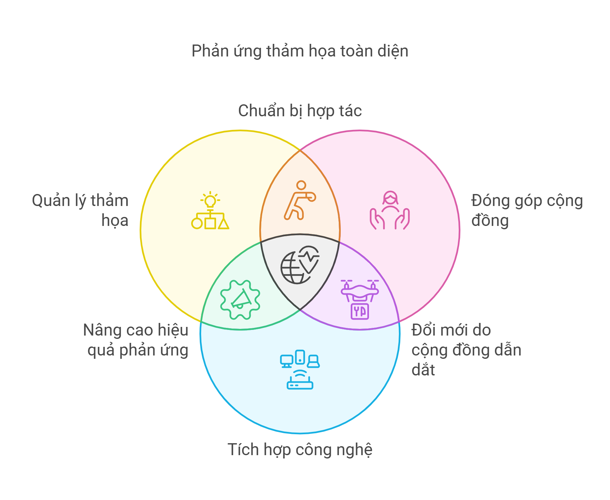

# Tổng quan

> *"💚 Ấn nút nhớ, thả hy vọng 🌿"*
## ☘️ ReliefLink
- *`RELIEFLINK`* là một nền tảng tiên tiến phát triển bới đội DTU_DZ dựa trên LCDP trong cuộc thi [Phần Mềm Nguồn Mở-Olympic Tin học Sinh viên Việt Nam 2024](https://www.olp.vn/procon-pmmn/ph%E1%BA%A7n-m%E1%BB%81m-ngu%E1%BB%93n-m%E1%BB%9F)
 nhằm hỗ trợ các khu vực chịu ảnh hưởng từ thiên tai, kết nối cộng đồng và quản lý quá trình cứu trợ.
- Mục tiêu của một dự án cứu trợ khẩn cấp trong thiên tai là hỗ trợ nhanh chóng và hiệu quả để bảo vệ sinh mạng và tài sản của người dân. Dự án tập trung vào cung cấp nhu yếu phẩm như thực phẩm, nước uống, chỗ ở tạm thời và hỗ trợ y tế khẩn cấp, đồng thời đảm bảo an toàn cho cộng đồng qua các biện pháp sơ tán và tăng cường khả năng ứng phó trong các tình huống khẩn cấp.Dự án còn hướng đến nâng cao khả năng chống chịu của cộng đồng, chuẩn bị sẵn sàng đối phó với các thảm họa trong tương lai.
## 🗝️Các chức năng chính của dự án
- 🔍Hỗ trợ và cứu trợ khẩn cấp
- ❤️‍🩹Quản lý nguồn lực hỗ trợ thiên tai
- 🌊Cảnh báo và hướng dẫn phòng chống thiên tai
- 🤝Kết nối giữa các cá nhân, tổ chức cứu trợ, cộng đồng 
##  Tổng quan hệ thống
| Công nghệ | Chức năng | Ưu điểm |
|-----------|-----------|----------|
| 📱 Appsmith | Phát triển giao diện | Tạo các giao diện người dùng (UI) dễ dàng mà không cần viết nhiều mã nguồn |
| ✏️ JavaScript | Xử lý sự kiện người dùng | Phát triển các ứng dụng web động cho phép trang web có tính tương tác và động. |
| 🌿 MongoDB  | Quản lý dữ liệu thời gian thực | Hiệu suất cao, phân tích dữ liệu chuyên sâu |
| 🖥️ Bootstrap | Hỗ trợ thiết kế repsponsive| Đảm bảo giao diện đẹp, responsive trên mọi thiết bị.
|🗺️ OSM | Bản đồ mở | Cho phép người dùng đóng góp và sử dụng dữ liệu bản đồ miễn phí |
|🕙 Realtime | Cập nhật dữ liệu | Giúp người dùng nhận được các thay đổi trong ứng dụng ngay lập tức|
|📈 WebSocket | Duy trì kết nối hai chiều | Dữ liệu có thể được truyền ngay lập tức khi có sự thay đổi,giảm thiểu độ trễ trong việc truyền tải dữ liệu |

### 🔍 Các tính năng chính

#### 🌪️ Cứu trợ khẩn cấp
- Xác định nhu cầu cứu trợ
- Phân phối cứu trợ
- Theo dõi tiến độ
- Kết nối với các dịch vụ khẩn cấp
#### 💰Quản lý nguồn lực
- Phân tích tình hình 
- Phân phối tài nguyên
- Đánh giá hiệu quả cứu trợ 
- Báo cáo kết quả
- Thông tin về các dịch vụ hỗ trợ và tài nguyên
#### ⚠️ Cảnh báo và hướng dẫn
- Hệ thống thông báo khẩn cấp
- Cảnh báo sớm về thảm họa
- Hướng dẫn ứng phó với thảm họa
- Giao tiếp trong tình huống khẩn cấp
#### 🤝 Kết nối cộng đồng
- Kết nối nhu cầu và nguồn lực
- Nền tảng tình nguyện viên
- Hệ thống điều phối cứu trợ
- Mạng lưới hỗ trợ khẩn cấp
### 🔬 Các lĩnh vực nghiên cứu

#### 🏃 Xây dựng hệ thống ứng cứu hiệu quả 
- Quản lý thảm họa
- Kinh tế cứu trợ thảm họa 
- Quản lý tình nguyện và lực lượng hỗ trợ
- Phân tích dữ liệu cộng đồng
- Hỗ trợ ra quyết định kịp thời và chính xác
#### 🌳 Đóng góp cộng đồng
- Hỗ trợ xây dựng cộng đồng
- Giải pháp năng lượng xanh
- Mô hình kinh tế tuần hoàn
- Đảm bảo tính linh hoạt và đổi mới 
#### 🧠  Tích hợp công nghệ
- Hệ thống quản lý và dự báo tích hợp
- Dẫn đường và chỉ dẫn
- Cảm biến môi trường
- Quản lý và phân phối tài nguyên cứu trợ(Blockchain)
- Chuyển tiền và thanh toán không biên giớ

##  📌 Các đặc điểm nổi bật  và lợi ích cho người dùng
- **Cảnh báo sớm và dự báo thiên tai** : Hệ thống cảnh báo sớm giúp giảm thiểu thiệt hại về người và tài sản, đồng thời tăng cường khả năng chuẩn bị của cộng đồng trước thiên tai.
- **Ứng phó tình huống khẩn cấp**  : Các phương án ứng phó khẩn cấp được triển khai nhanh chóng và hiệu quả nhờ vào công nghệ hiện đại, giúp cứu sống nhiều người và giảm thiểu rủi ro cho các đội cứu hộ.
- **Tác động tích cực trên nhiều khía cạnh** :  Xã hội , kinh tế , môi trường, công nghệ
- **Đối với cộng đồng và người dân** : Tham gia vào các chương trình đào tạo và tập huấn về ứng phó thiên tai.Chủ động tìm hiểu về các biện pháp phòng tránh và ứng phó với thiên tai.Hỗ trợ lẫn nhau trong các tình huống khẩn cấp, đặc biệt là các nhóm dễ bị tổn thương như người già, trẻ em, và người khuyết tật.
- **Đối với các doanh nghiệp và nhà đầu tư** : Hỗ trợ tài chính và công nghệ để phát triển và triển khai các giải pháp của dự án.Đóng góp vào các hoạt động cứu trợ và tái thiết như một phần của trách nhiệm xã hội doanh nghiệp.

       *`RELIEFLINK`* không chỉ là một dự án hỗ trợ khẩn cấp mà còn là một lời kêu gọi hành động – hành động vì sự an toàn của cộng đồng, vì sự phát triển bền vững của đất nước, và vì tương lai của thế hệ mai sau.

## 🌏 Mục tiêu dài hạn của dự án 

-  **Tăng cường năng lực ứng phó với thảm họa** : Hệ thống có thể trở thành một công cụ quan trọng cho các quốc gia thường xuyên chịu ảnh hưởng bởi thiên tai, giúp nâng cao khả năng ứng phó nhanh chóng và giảm thiểu thiệt hại.Mở rộng ứng dụng cho các tình huống khẩn cấp khác, như dịch bệnh, khủng hoảng nhân đạo, hoặc các sự kiện bất ngờ.
- **Phát triển thành một nền tảng quốc tế** : Dự án có tiềm năng trở thành một hệ thống tiêu chuẩn, được sử dụng bởi các tổ chức quốc tế và các tổ chức nhân đạo khác để phối hợp cứu trợ trên toàn cầu.
- **Ứng dụng trí tuệ nhân tạo và phân tích dữ liệu lớn** : Sử dụng AI để phân tích và dự đoán thảm họa, từ đó cải thiện khả năng chuẩn bị và ứng phó trước khi thảm họa xảy ra.Phân tích dữ liệu lớn (Big Data) để tối ưu hóa việc phân bổ nguồn lực, dự đoán nhu cầu cứu trợ và đánh giá hiệu quả của các hoạt động cứu trợ
- **Mở rộng sang lĩnh vực tái thiết và phục hồi** : Hệ thống không chỉ dừng lại ở giai đoạn cứu trợ mà còn hỗ trợ tái thiết cơ sở hạ tầng và khôi phục kinh tế sau thảm họa.Tích hợp công nghệ để quản lý việc tái thiết, đảm bảo tính bền vững và lâu dài cho các cộng đồng bị ảnh hưởng.
- **Khai thác các công nghệ tiên tiến** : Ứng dụng IoT (Internet of Things) để thu thập dữ liệu thời gian thực từ các cảm biến và thiết bị thông minh, giúp cải thiện độ chính xác trong việc phát hiện và đánh giá thảm họa.

Với những tiềm năng này, dự án có thể trở thành một nền tảng toàn diện và hiệu quả để hỗ trợ không chỉ trong cứu trợ khẩn cấp mà còn trong việc xây dựng khả năng phục hồi lâu dài cho các cộng đồng trên toàn thế giới.

## 🌿 Kỳ vọng tương lai
    -   Ứng dụng này hướng tới các mục tiêu xây dựng một hệ thống phản ứng nhanh chóng,cải thiện khả năng đánh giá và đáp ứng nhu cầu cứu trợ ngay khi thảm họa xảy ra, rút ngắn thời gian từ khi thảm họa bắt đầu đến khi hỗ trợ được cung cấp. hiệu quả và bền vững, giúp cộng đồng đối phó tốt hơn với các thảm họa.Hệ thống sẽ tìm cách phát triển các nguồn lực bền vững như các quỹ cứu trợ dài hạn, các sáng kiến tái thiết và phục hồi sau thiên tai, giúp cộng đồng nhanh chóng phục hồi sau thảm họa và có thể đối phó tốt hơn với thảm họa trong tương lai.Đóng góp một phần vào việc xây dựng cộng đồng.

## 💡Nhà phát triển

📧 Email: thanhtruong23111999@gmail.com

📱 Hotline: +84 376 659 652

*" 🏫 DTU_DZ - DUY TAN UNIVERSITY - SCS ✨"*
### 📝 License
Dự án này được cấp phép theo các điều khoản của giấy phép [GPL V3 License](https://github.com/olp-dtu-2024/DTU-GreenHope/blob/main/LICENCE)

