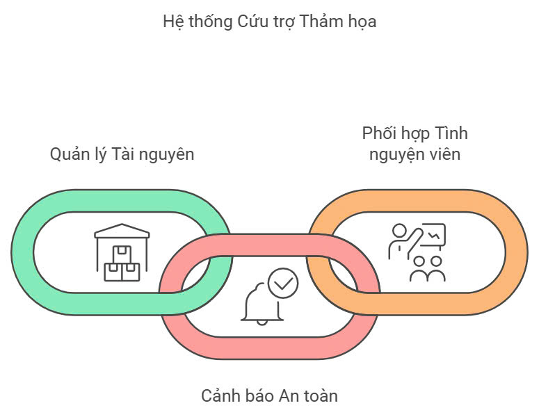
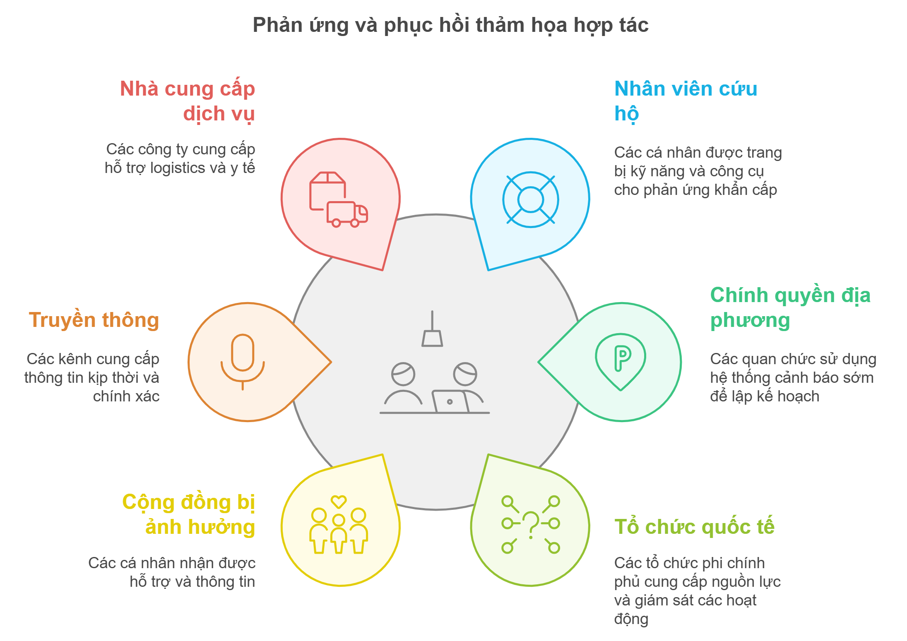

# Giới thiệu về dự án 

> *"💚 Ấn nút nhớ, thả hy vọng 🌿"*

Ứng dụng hỗ trợ cứu nạn khẩn cấp và quản lý nguồn lực

  Mục tiêu của dự án  là phát triển một hệ thống dựa trên `nền tảng LCDP` ứng dụng công nghệ trí tuệ nhân tạo để hỗ trợ tìm kiếm người mất tích, đánh giá thiệt hại và quản lý tái thiết sau thảm họa.

Dự án được thực hiện trong cuộc thi [ Phần Mềm Nguồn Mở-Olympic Tin học Sinh viên Việt Nam 2024](https://www.olp.vn/procon-pmmn/ph%E1%BA%A7n-m%E1%BB%81m-ngu%E1%BB%93n-m%E1%BB%9F)
. Được open source theo giấy phép [GNU General Public License](https://github.com/olp-dtu-2024/DTU-GreenHope/blob/main/LICENCE)  v3.0 bởi đội tác giả DTU_DZ.

**`RELIEFLINK`** Dự án cứu nạn khẩn cấp nhằm xây dựng một hệ thống hiệu quả để cung cấp các dịch vụ cứu trợ khẩn cấp và quản lý tài nguyên trong các tình huống thảm họa. Hệ thống này sử dụng công nghệ bản đồ để theo dõi và phân phối tài nguyên như thực phẩm, nước, và thuốc men, giúp các đội cứu hộ phản ứng nhanh chóng và chính xác. Các tính năng của hệ thống bao gồm việc tự động phân bổ tài nguyên theo nhu cầu và vị trí, cung cấp giao diện người dùng thân thiện dựa trên `nền tảng LCDP` để quản lý và điều phối hoạt động cứu hộ, đồng thời phân tích dữ liệu thời gian thực để đưa ra các quyết định kịp thời. Mục tiêu của dự án là tối ưu hóa quy trình cứu trợ, giảm thiểu thời gian phản ứng và đảm bảo rằng các nạn nhân nhận được sự hỗ trợ kịp thời nhất.

## 📂 Chức Năng Chính

- ❤️‍🩹 Hỗ trợ cứu hộ cứu nạn khẩn cấp
- 🫶 Quản lý và phân phối nguồn lực cứu trợ
- 🌪️ Cảnh báo và hướng dẫn an toàn trong thảm hoạ

## 🎯 Mục tiêu 
-  **Tăng cường hiệu quả cứu trợ**: Cung cấp công cụ để theo dõi, phân bổ và quản lý tài nguyên cứu trợ (thực phẩm, nước, thuốc men, v.v.) một cách nhanh chóng và chính xác, đảm bảo các đội cứu hộ có thể đáp ứng nhu cầu kịp thời.

-  **Ứng dụng công nghệ bản đồ**: Sử dụng bản đồ trực tuyến để xác định và hiển thị các khu vực bị ảnh hưởng, từ đó hỗ trợ việc phân bổ tài nguyên và điều phối các đội cứu hộ một cách hiệu quả.

-  **Phân tích dữ liệu và đưa ra quyết định**: Thu thập và phân tích dữ liệu từ các nguồn khác nhau để đưa ra các quyết định kịp thời về việc phân phối tài nguyên, điều động lực lượng cứu hộ và tối ưu hóa các hoạt động cứu trợ.

- **Tăng cường phối hợp và điều phối**: Cung cấp các giao diện dễ sử dụng để các đơn vị cứu hộ có thể phối hợp với nhau, đảm bảo hoạt động cứu trợ diễn ra thông suốt và hiệu quả trong mọi tình huống.
- **Giảm thiểu thời gian phản ứng**: Cải thiện thời gian phản ứng của các đội cứu hộ, giúp giảm thiểu thiệt hại và nâng cao khả năng phục hồi của cộng đồng sau thảm họa..
- **Cải thiện khả năng tiếp cận và hỗ trợ cộng đồng**: Xây dựng các tính năng đặc biệt để đảm bảo các nhóm người dễ bị tổn thương như người già, trẻ em, người khuyết tật nhận được sự hỗ trợ kịp thời và công bằng.

## 📢 Đối tượng hướng đến

- **Nhân viên cứu hộ và cứu trợ**: Những người tham gia vào công tác cứu hộ, cứu trợ và phục hồi sau thiên tai. Họ cần được trang bị kiến thức, kỹ năng và công cụ cần thiết để thực hiện nhiệm vụ một cách hiệu quả.

- **Chính quyền địa phương và các cơ quan quản lý thiên tai** : 	Sử dụng hệ thống cảnh báo sớm để lập kế hoạch ứng phó hiệu quả.
Tối ưu hóa việc điều phối nguồn lực cứu hộ thông qua hệ thống quản lý thông minh (smart management system).Đánh giá thiệt hại nhanh chóng và chính xác, từ đó đưa ra các quyết định tái thiết phù hợp.
	

- **Nhà tài trợ và tổ chức quốc tế**: Các tổ chức phi chính phủ, nhà tài trợ và các tổ chức quốc tế đóng vai trò quan trọng trong việc cung cấp nguồn lực cho công tác cứu trợ. Họ sẽ sử dụng nền tảng để theo dõi và giám sát các hoạt động tái thiết, đồng thời đảm bảo rằng nguồn lực được phân phối đúng nơi cần thiết.

- **Cộng đồng bị ảnh hưởng bởi thảm họa** : Các cá nhân và cộng đồng trực tiếp chịu ảnh hưởng từ thảm họa sẽ có thể nhận được hỗ trợ thông qua nền tảng. Hệ thống cung cấp thông tin về các hoạt động cứu trợ, tái thiết và giúp kết nối với các tổ chức cung cấp nguồn lực.
- **Truyền thông**: Đóng vai trò quan trọng trong việc truyền tải thông tin kịp thời và chính xác đến người dân và các cơ quan chức năng.

- **Các tổ chức, công ty cung cấp dịch vụ cứu nạn**: Các công ty cung cấp dịch vụ cứu hộ, y tế, vật tư, và tái thiết cơ sở hạ tầng sẽ sử dụng hệ thống để theo dõi các yêu cầu và hỗ trợ các hoạt động cứu nạn và phục hồi. Họ có thể nhận thông tin chi tiết về khu vực bị ảnh hưởng và điều phối các nguồn lực cần thiết.

- **Các nhà nghiên cứu và chuyên gia trong lĩnh vực thảm họa và tái thiết**: Các nhà nghiên cứu, chuyên gia trong lĩnh vực thiên tai, cứu trợ và tái thiết sẽ sử dụng ứng dụng để thu thập dữ liệu, phân tích xu hướng thiệt hại và cải tiến các chiến lược phục hồi cho các thảm họa trong tương lai.

## 💡Nhà phát triển

📧 Email: thanhtruong23111999@gmail.com

📱 Hotline: +84 376 659 652

*" 🏫 DTU_DZ - DUY TAN UNIVERSITY - SCS ✨"*
### 📝 License
Dự án này được cấp phép theo các điều khoản của giấy phép [GPL V3 License](https://github.com/olp-dtu-2024/DTU-GreenHope/blob/main/LICENCE)
